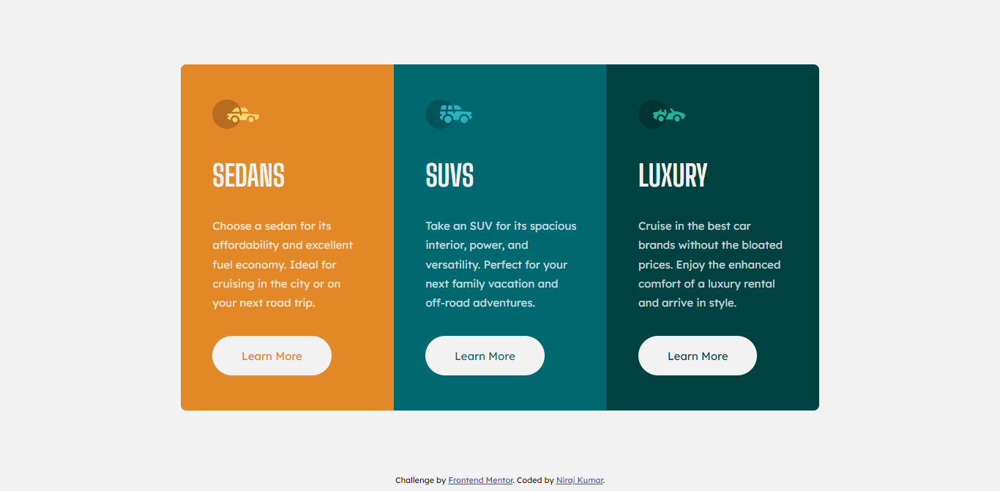

# Frontend Mentor - 3-column preview card component solution

This is a solution to the [3-column preview card component challenge on Frontend Mentor](https://www.frontendmentor.io/challenges/3column-preview-card-component-pH92eAR2-). Frontend Mentor challenges help you improve your coding skills by building realistic projects. 

## Table of contents

- [Overview](#overview)
  - [The challenge](#the-challenge)
  - [Screenshot](#screenshot)
  - [Links](#links)
- [My process](#my-process)
  - [Built with](#built-with)
  - [What I learned](#what-i-learned)
- [Author](#author)

## Overview

### The challenge

Users should be able to:

- View the optimal layout depending on their device's screen size
- See hover states for interactive elements

### Screenshot




### Links

- Solution URL: [My solution](https://your-solution-url.com)
- Live Site URL: [niraj-three-column-preview](https://niraj-three-column-preview.netlify.app/)

## My process

### Built with

- Semantic HTML5 markup
- CSS custom properties
- Flexbox
- Mobile-first workflow


### What I learned

Proud of my us of --present-parent-background variable. I rename it not only in the root tag, but also in individual card, so thst learn more button can inherit it from them.

```css
:root{
  --present-parent-background: var(--Very-light-gray);
}

.luxury-card {
  width: 100%;
  background-color: var(--Very-dark-cyan);
  --present-parent-background: var(--Very-dark-cyan);
  display: flex;
  flex-direction: column;
  justify-content: center;
  align-items: flex-start;

  padding-left: 14.5%;
  padding-right: 14.5%;

  border-bottom-left-radius: 0.5rem;
  border-bottom-right-radius: 0.5rem;
}

.learn-more-button {
  background-color: var(--Very-light-gray);
  color: var(--present-parent-background);

  padding: 1em 2.5em;
  border-radius: 3em;
  border: 0.15em solid transparent;
  margin-bottom: 3rem;
}

```


## Author

<!-- - Website - [Add your name here](https://www.your-site.com) -->
- Frontend Mentor - [@niraj-kumar-r](https://www.frontendmentor.io/profile/niraj-kumar-r)
- Twitter - [@niraj_kumar_r](https://twitter.com/niraj_kumar_r)
